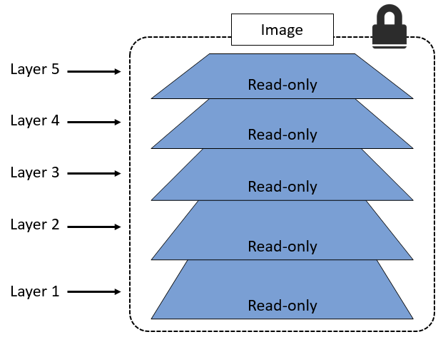
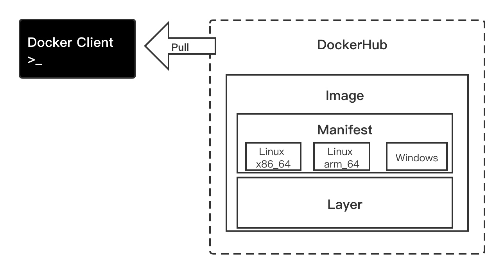
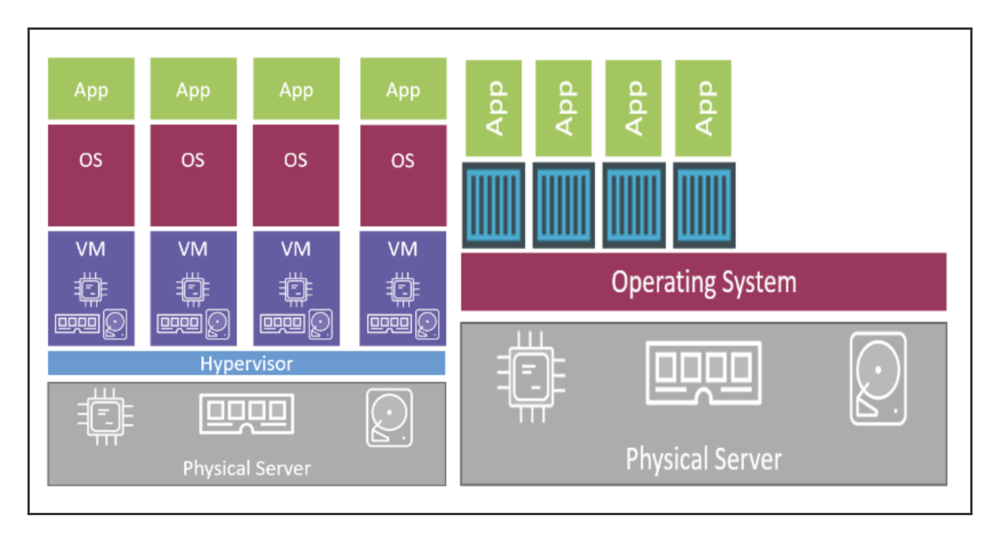

# Docker
## Docker安装
### Windows安装Docker
1. 在安装之前，有以下需求：
    - Windows10 Pro/Enterprise/Edu 1607+。
    - Windows必须是64位版本。
    - 需要启用Hype-V和容器特性。
    - BIOS开启虚拟化支持。
2. 访问Docker的下载页面，完成下载并安装。
3. 在安装后，运行`docker version`命令，响应结果中Server部分的`OS/Arch`展示当前操作系统是`linux/amd64`，在默认安装方式中，Docker daemon是运行在Hype-V虚拟机中的轻量级Linux上的，该情况下，只能运行Linux容器。使用命令` .\dockercli SwitchDaemon`可以切换到Windows容器，此时Docker daemon运行在Windows内核上，该种情况下只能运行Windows容器。

| WindowsDocker包含组件 | 描述 | 查看版本 |
| --- | --- | --- |
| Docker daemon/client | Docker引擎/客户端 | docker —-version |
| Docker Compose | 定义和运行多容器Docker应用程序 | docker-compose —-version |
| Docker Machine | 在虚拟主机上安装Docker 的工具 | docker-machine —-version |
| Docker Notary | 验证Docker资产来源 | notary version |

### Linux安装Docker
```shell
$ sudo yum install -y yum-utils device-mapper-persistent-data lvm2 # 安装依赖
$ sudo yum-config-manager --add-repo https://download.docker.com/linux/centos/docker-ce.repo # 设置稳定的仓库
$ sudo yum install docker-ce docker-ce-cli containerd.io #安装Docker CE
```

`docker version`:
```
Client:
 Version:         1.13.1
 API version:     1.26
 Package version: docker-1.13.1-103.git7f2769b.el7.centos.x86_64
 Go version:      go1.10.3
 Git commit:      7f2769b/1.13.1
 Built:           Sun Sep 15 14:06:47 2019
 OS/Arch:         linux/amd64

Server:
 Version:         1.13.1
 API version:     1.26 (minimum version 1.12)
 Package version: docker-1.13.1-103.git7f2769b.el7.centos.x86_64
 Go version:      go1.10.3
 Git commit:      7f2769b/1.13.1
 Built:           Sun Sep 15 14:06:47 2019
 OS/Arch:         linux/amd64
 Experimental:    false
```

### Docker存储驱动的选择
- 配置docker的存储驱动：
    通常在`/etc/docker/daemon.json`中设置：
    ```json
    {
        "storage-driver": "overlay2"
    }
    ```
    
- 查看当前Docker系统环境信息：`docker system info`。

#### 自动配置direct-lvm
大部分情况下Device Mapper需要合理配置才能表现出良好的性能，默认情况下Device Mapper采用loopback mounted sparse file 作为底层来为Docker提供存储支持。为了达到DM在生产环境的最佳性能，需要将底层实现修改为direct-lvm模式。这种模式下通过使用基于裸块设备（Raw Block Device）的LVM（LVM thin pool）精简池来获取更好性能。在daemon.json中添加：
```json
{
  "storage-driver": "devicemapper",
  "storage-opts": [
    "dm.directlvm_device=/dev/sdb",
    "dm.thinp_percent=95",
    "dm.thinp_metapercent=1",
    "dm.thinp_autoextend_threshold=80",
    "dm.thinp_autoextend_percent=20",
    "dm.directlvm_device_force=false"
  ]
}
```

#### 手动配置direct-lvm
- 在使用direct-lvm时，应保证有可用的块设备，通常是高性能LUN存储或本地SSD。
- direct-lvm底层利用LVM来实现，因此需要配置LVM所需的物理设备、卷组、逻辑卷和精简池。应当使用专用的物理卷并将其配置在相同的卷组当中，这个卷不应该被Docker之外的工作负载所使用。
- 修改Docker配置前应备份`daemon.json`。

> 参考：[Docker 1.12 配置 direct-lvm](https://c7sky.com/docker-1-12-config-direct-lvm.html)

## 纵观Docker
### 镜像
镜像实际上等价于未运行的容器。
```shell
$ docker image ls
```
```
REPOSITORY          TAG                 IMAGE ID            CREATED             SIZE
docker.io/ubuntu    latest              549b9b86cb8d        3 months ago        64.2 MB
```
- `docker image pull ` 拉取的ubuntu镜像有一个精简版的Ubuntu Linux系统，其中包含部分Ubuntu常用工具。而Windows拉取的`microsoft/powershell`镜像则包含了带有PowerShell的Windows Nano Server操作系统。
- Docker的每个镜像都拥有一个唯一的ID，用户可以通过引用镜像ID或名称来使用镜像，只需要输入ID开头的前几个字符。

### 容器
当镜像启动后的运行环境即为容器。
```shell
$ docker container run -it ubuntu /bin/bash # 启动新的容器
```
- 使用`Ctrl-PQ`组合键可以在退出容器的同时并保证容器在后台运行。
- 使用`docker container ls`来查看运行中的容器，使用`-a`参数可以看到所有容器。
- 使用`ps -elf`来查看容器中的进程。
```shell
$ docker container exec -it [id] [进程] # 连接到后台运行的容器
```

## Docker引擎
### 简介
Docker引擎是用来运行和管理容器的核心软件。通常人们会简单的将其代指为Docker或Docker平台。
#### 构成
- Docker client（客户端）
- Docker daemon（守护进程）
- containerd
- runc

下图为各组件关系：


目前Docker引擎的架构示意图如图所示：

### runc
runc时OCI容器运行时规范的参考实现，实质上是一个轻量级的、针对Libcontainer进行了包装的命令行交互工具（Libcontainer取代了早期Docker架构中的LXC）。一个独立的容器运行时工具，runc唯一的作用是创建容器。也将runc所在的层叫OCI层。

### containerd
将Docker daemon的功能拆解后，所有的容器执行逻辑被重构到containerd中。它主要的任务是容器的生命周期管理

### shim
shim是实现无daemon的容器不可或缺的工具。containerd来指挥runc来创建新的容器，创建完毕后，runc会退出，相关联的containerd-shim 进程就会成为容器的父进程，来保证STDIN/STDOUT流为开启状态，并将容器的退出状态反馈给daemon。

### 容器的启动过程
1. Docker Client向Docker API(daemon)发送`docker container run `命令；
2. API端点接受指令后指示containerd创建容器；
3. containerd将image转换为OCI bundle并发送给runc；
4. runc与操作系统内核接口通信，基于所有需要的工具（Namespace、Cgroup等）来创建容器；
5. 容器作为runc的子进程启动，runc退出，相关联的containerd-shim成为容器的父进程。


## Docker镜像
镜像由多个层组成，每层叠加之后，从外部看起来就如一个度心里的对象。镜像的内部是一个精简的操作系统，同时还包含应用运行所需的文件和依赖包。镜像可以理解为一种构建时（build-time）结构，容器可以理解为运行时（run-time）结构。


### 拉取镜像
- docker本地镜像仓库通常位于`/var/lib/docker/<storage-driver>`
    
    
- 只需要给出镜像的名字和标签就可以在镜像仓库中定位一个镜像：
    ```shell
    $ docker image pull <repository>:<tag>
    ```
- 如果没有显式给定标签，Docker会假设用户希望拉取标签为`latest`的镜像；
- 如果希望从第三方仓库服务获得镜像，需要在镜像名称前加上第三方仓库服务DNS地址；
- `latest`标签不代表该镜像是最新镜像，标签命名是随意的；

### Client的输出内容
- Docker提供`--filter`来过滤`docker image ls`命令返回的镜像列表内容。
    ```shell
        $ docker image ls --filter dangling=true # 只返回悬虚镜像
    ```
    
    可以通过`docker image prune`来移除全部的悬虚镜像。
    > 悬虚镜像是指没有标签的镜像，当一个镜像重新构建后，打上了已经存在的标签，Docker会移除旧镜像上的标签，将该标签给新构建的镜像，旧的镜像成为悬虚镜像。
- 使用`--format`参数来通过Go模板对输出内容进行格式化
    ```shell
        $ docker image ls --format "{{.Repository}}: {{.Tag}}: {{.Size}}" # 返回仓库:标签:大小
    ```

### 通过CLI方式来搜索Docker Hub
- 通过“NAME”字段进行模糊匹配：
    ```shell
    $ docker search <NAME> --filter "is-official=true/false" # 过滤官方/非官方镜像
    ```
- 搜索默认只返回25行结果，可以使用`--limit`参数来指定返回的行数：
    ```shell
     $ docker search <NAME> --limit x # (x<=100)
    ```
    

### 镜像和分层
Docker镜像由一些松耦合的层组成


所有的Docker镜像都起始于一个基础镜像层，当进行修改或增加新的内容时，就会在当前的镜像层之上创建新的镜像层。在添加额外镜像层的同时，镜像始终保持是当前所有镜像的组合。

### 查看镜像分层
```shell
$ docker image inspect <repository>:<tag>
```


### 镜像摘要（散列值）
Docker一用了内容寻址存储模型，作为模型的一部分，每个镜像都有一个基于其内容的散列值（Content Hash），镜像内容的变更一定会引起镜像散列值的变更。每个镜像层也有基于其内容的散列值，同时还拥有一个压缩版的分发散列值（Distribution Hash），用于校验镜像或镜像层在拉取/推送操作后其内容是否改变，保证了镜像的安全性。

### 多架构的镜像
当用户获取一个镜像时，Docker 引擎会首先查找该镜像是否有 manifest 列表，如果有的话 Docker 引擎会按照 Docker 运行环境（系统及架构）查找出对应镜像，如果没有的话会直接获取镜像。


### 删除镜像
```shell
$ docker image rm [id] # 删除某一镜像
$ docker image rm $(docker image ls -q) -f # 删除所有镜像
```
如果被删除的镜像还有正在运行的容器，则不能删除该镜像。如果被删除镜像的某一层被其他镜像共享，则需要删除所有依赖该层的所有镜像后，该层才会被删除。

## Docker容器
### 概述
容器是镜像的运行时实例。

```shell
$ docker container run -it [image] [app] # 启动一个容器并连接到shell
$ docker container stop [id]  # 停止一个容器
```
> `-it`的作用是将当前终端连接到容器的shell终端

### 虚拟机和容器的区别


1. Hypervisor是硬件虚拟化，将硬件物理资源划分成虚拟资源。容器是操作系统虚拟化，将系统资源划分为虚拟资源。
2. 虚拟机模型有不可避免的额外开销，而容器可以缩减额外开销。
3. 虚拟机的启动速度要慢于容器。

### 容器生命周期
Docker容器的持久化（persistent）。
容器可以根据需要多次的停止、启动、暂停、重启，并且这些操作执行的很快。但是容器内的数据是安全的。直至明确的删除容器前，容器都不会丢弃其中的数据，如果数据通过容器持久化到卷中，那么删除容器也不会影响数据。

### 两阶段删除容器
1. 使用`docker container stop`来停止容器，向容器内PID为1的进程发送`SIGTERM`信号，会为容器的停止留出一定的处理后续工作的时间；
2. 若在一定时间内进程没有终止，则会收到`SIGKILL`信号来强制结束进程。
3. `docker container rm [id] -f`中`-f`会直接发出`SIGKILL`强制结束进程并删除容器。

### 重启策略
```shell
$ docker container run --name [name] --restart [always|unless-stopped|on-failed]
```

| --restart | Remark |
| --- | --- |
| always | 除非容器明确被停止过，否则自动重启，daemon启动跟着启动 |
| unless-stopped | 除非容器明确被停止过，否则自动重启，不会跟着dameon启动  |
| on-failed | 总会在容器返回值不为1的时候重启，stop后跟着dameon重启 |


## 应用的容器化
> 容器因应用而生，容器能够简化应用的构建、部署和运行过程。

### 应用容器化的步骤

1. 编写应用代码；
2. 创建一个Dockerfile，其中应该包括当前应用的描述、依赖以及如何运行这个程序；
3. 对该Dockerfile执行`docker image build`命令；
4. 等待Docker将应用程序构建到Docker镜像中。


> `docker image build []`
> - `-t` :镜像打标签
> - `-f` :指定Dockerfile路径和名称（可以是远程仓库）
> - `--nocache=true` :强制不使用缓存
> - `--squash` :创建一个合并的镜像

### 应用容器化实例
1. 工作目录
    ```
    [root@VM_0_6_centos psweb]# ll
    total 28
    -rw-r--r-- 1 root root  341 Sep 27  2017 app.js
    -rw-r--r-- 1 root root  216 Sep 27  2017 circle.yml
    -rw-r--r-- 1 root root  338 Sep 27  2017 Dockerfile
    -rw-r--r-- 1 root root  421 Sep 27  2017 package.json
    -rw-r--r-- 1 root root  370 Sep 27  2017 README.md
    drwxr-xr-x 2 root root 4096 Sep 27  2017 test
    drwxr-xr-x 2 root root 4096 Sep 27  2017 views
    ```

1. Dockerfile
    ```
    [root@VM_0_6_centos psweb]# cat Dockerfile 
    # 指定镜像会作为当前的基础镜像层（layer+1）
    FROM alpine
    # K,V 维护者标签
    LABEL maintainer="nigelpoulton@hotmail.com"
    # 在基础镜像层上新建层安装Node和NPM （layer+1）
    RUN apk add --update nodejs nodejs-npm
    # 将当前目录构建上下文拷贝到镜像/src （layer+1）
    COPY . /src
    # 为接下来尚未执行的命令设置工作路径（在元数据中保存）
    WORKDIR /src
    # 根据package.json中的配置使用npm安装相关依赖（layer+1）
    RUN  npm install
    # 开放端口8080（在元数据中保存）
    EXPOSE 8080
    # 指定镜像入口程序（在元数据中保存）
    ENTRYPOINT ["node", "./app.js"]
    ```
    
3. 构建镜像
    ```
    [root@VM_0_6_centos psweb]# docker image build -t web:latest .
    Sending build context to Docker daemon 10.24 kB
    Step 1/8 : FROM alpine
    Trying to pull repository docker.io/library/alpine ... 
    latest: Pulling from docker.io/library/alpine
    cbdbe7a5bc2a: Pull complete 
    Digest: sha256:9a839e63dad54c3a6d1834e29692c8492d93f90c59c978c1ed79109ea4fb9a54
    Status: Downloaded newer image for docker.io/alpine:latest
     ---> f70734b6a266
    Step 2/8 : LABEL maintainer "nigelpoulton@hotmail.com"
     ---> Running in d85956d441af
     ---> f8d494972210
    Removing intermediate container d85956d441af
    Step 3/8 : RUN apk add --update nodejs nodejs-npm
     ---> Running in b7bbbe025d59
    ```
    
4. 将镜像上传到registry
    ```
    [root@VM_0_6_centos psweb]# docker image push liujinji0452/web:latest 
    The push refers to a repository [docker.io/liujinji0452/web]
    1e5281ea2f87: Pushed 
    27acb27bb4bb: Pushed 
    58c050a0ef2e: Pushed 
    3e207b409db3: Mounted from library/alpine 
    latest: digest: sha256:fd7ce0084671a5d6751979029dbe408b889e494d96337f85fe228171b6e544e2 size: 1159
    ```

## 生产环境中的多阶段构建
目标是将其缩小到仅包含运行应用所**必需**的内容即可。
### 建造者模式（Builder Pattern）
-至少需要两个Dockerfile。Dockerfile.dev基于一个大型基础镜像，拉取所需的构建工具并构建应用。接下来基于Dockerfile.dev构建一个镜像并创建一个容器。然后编写Dockerfile.prod，它基于一个较小的基础镜像创建，并从dev创建的容器中将应用程序相关的部分复制过来。整个过程 需要额外的脚本才能串联起来。

### 多阶段构建（Multi-Stage Build）
使用一个Dockerfile，其中包含多个FROM指令，每个FROM指令都是一个新的构建阶段（Build-Stage），并且可以方便的复制之前阶段的构建。
```
[root@aliyun app]# cat Dockerfile
FROM node:latest AS storefront # 定义构建阶段的别名
WORKDIR /usr/src/atsea/app/react-app
COPY react-app .
RUN npm install
RUN npm run build

FROM maven:latest AS appserver
WORKDIR /usr/src/atsea
COPY pom.xml .
RUN mvn -B -f pom.xml -s /usr/share/maven/ref/settings-docker.xml dependency:resolve
COPY . .
RUN mvn -B -s /usr/share/maven/ref/settings-docker.xml package -DskipTests

FROM java:8-jdk-alpine
RUN adduser -Dh /home/gordon gordon
WORKDIR /static
COPY --from=storefront /usr/src/atsea/app/react-app/build/ .
WORKDIR /app
COPY --from=appserver /usr/src/atsea/target/AtSea-0.0.1-SNAPSHOT.jar .
ENTRYPOINT ["java", "-jar", "/app/AtSea-0.0.1-SNAPSHOT.jar"]
CMD ["--spring.profiles.active=postgres"]
```

`COPY --FROM`从之前的阶段构建的镜像中**仅复制生产环境相关的应用代码**，而不会复制生产环境不需要的构件。

### 利用构建缓存
`docker image build` 命令会从顶层开始解析Dockerfile中的命令并逐行执行，每条指令执行前都会检查缓存中是否有与该指令对应的镜像层，如果有则称为「缓存命中」（Cache Hit），并会使用这个镜像层；如果没有则称为「缓存未命中」（Cache Miss），Docker会基于该指令重新构建该镜像层。如果出现缓存命中的情况可以大大减少整个镜像的构建时间。
如果在某行出现了缓存未命中的情况，Docker在接下来的构建过程中再也不会检查缓存而是全部重新构建，所以，我们在编写Dockerfile时，应该把不太变动的镜像层放在前方去执行，把易于变动的指令尽量放在后方，最大程度减少镜像构建时间。
> build时加入`--nocache=true`参数可以强制不使用缓存

### 合并镜像层
#### 合并镜像层的影响
- 镜像层共享率低
- 存储空间了利用率低
- push/pull需要传输更大的体积

#### 何时选择合并？
- build加入`--squash`参数来构建一个合并的镜像
- 当好几层镜像层作为构建其它镜像的基础镜像时

## Docker Compose部署
部署和管理多个服务是困难的，Docker-Compose通过一个声明式的配置文件来描述整个应用，从而使用一条命令实现部署。

### 配置文件
```
$ cat docker-compose.yml 
version: '3'
services:
  web:
    build: .
    ports:
     - "5000:5000"
  redis:
    image: "redis:alpine"
```
- **version**: 声明了当前compose版本
- **service**: 应用中所包含的服务
- **web**: 该web服务从当前目录构建，容器向外暴露5000端口
- **redis**: 声明redis服务直接使用公共镜像

### Dockerfile
```
$ cat Dockerfile 
# 拉取python镜像
FROM python:3.7-alpine
# 设置工作路径
WORKDIR /code
# 设置FLASK的环境
ENV FLASK_APP app.py
ENV FLASK_RUN_HOST 0.0.0.0
# 这里更改一下Alpine镜像源，官方源国内很慢
RUN sed -i 's/dl-cdn.alpinelinux.org/mirrors.ustc.edu.cn/g' /etc/apk/repositories
# 安装编译依赖
RUN apk add --no-cache gcc musl-dev linux-headers
# 从构建上下文复制python依赖
COPY requirements.txt requirements.txt
# 安装python依赖，加上 -i 指定pip源
RUN pip install -r requirements.txt -i https://pypi.tuna.tsinghua.edu.cn/simple
# 从构建上下文复制文件到镜像工作路径
COPY . .
# 启动FLASK应用
CMD ["flask", "run"]
```

### 使用Compose命令构建和运行
```shell
$ docker-compose up -d # [-d]指定可以后台运行
```
构建完成后，可以查看到基于`docker-compose.yml`服务名称的Docker容器在运行：
```
[root@aliyun compose-test]# docker container ls
CONTAINER ID        IMAGE               NAMES
39ee6cbf51d2        redis:alpine        composetest_redis_1
4e3bd45934ea        composetest_web     composetest_web_1
```
另外，使用`docker-compose ps`命令可以看到处于运行状态的服务
```
       Name                      Command               State           Ports         
-------------------------------------------------------------------------------------
composetest_redis_1   docker-entrypoint.sh redis ...   Up      6379/tcp              
composetest_web_1     flask run                        Up      0.0.0.0:5000->5000/tcp
```

### 使用Docker Compose来管理应用
#### 停止应用 （down）

```
$ docker-compose down
# 开始停止容器
Stopping composetest_redis_1 ... 
Stopping composetest_web_1   ... 
# stop指令发送SIGTERM到每个容器PID为1的进程
redis_1  | 1:signal-handler (1590136806) Received SIGTERM scheduling shutdown...
# 关闭进程
redis_1  | 1:M 22 May 2020 08:40:06.653 # User requested shutdown...
redis_1  | 1:M 22 May 2020 08:40:06.653 * Saving the final RDB snapshot before exiting.
redis_1  | 1:M 22 May 2020 08:40:06.655 * DB saved on disk
Stopping composetest_redis_1 ... done
# redis停止
composetest_redis_1 exited with code 0
# web停止
Stopping composetest_web_1   ... done
# 删除已停止的服务
Removing composetest_redis_1 ... done
Removing composetest_web_1   ... done
# 删除网络界面
Removing network composetest_default
```
> 如果compose应用挂载了卷，则所有服务停止后，卷并不会被删除，因为卷是用于数据的长期持久化存储。因此，卷的生命周期与相应的容器是完全解耦的。使用`docker volume ls`来查看挂载的卷。

#### 停止应用（stop）
```
$ docker-compose stop
Stopping composetest_redis_1 ... done
Stopping composetest_web_1   ... done
```
使用stop命令也能停止应用，与down命令不同的是，d**own在停止后会删除资源（网络界面、容器等）**。而stop只是停止了容器的运行，**不会删除资源**，且可以很方便的通过restart来重启应用。下面的进程信息是使用stop后查看的：
```
[root@aliyun compose-test]# docker-compose ps
       Name                      Command                State     Ports
-----------------------------------------------------------------------
composetest_redis_1   docker-entrypoint.sh redis ...   Exit 0          
composetest_web_1     flask run                        Exit 137
```

> 关于卷：因为在应用被删除后，挂载的卷资源不会被释放，所以在重新使用compose创建应用时，compose会检查是否存在该卷，若存在则直接应用，若不存在则定义新卷并挂载。另外，Docker Compose 会在构建的**最开始就创建网络界面和挂载卷**，因为他们是容器的底层依赖资源。

